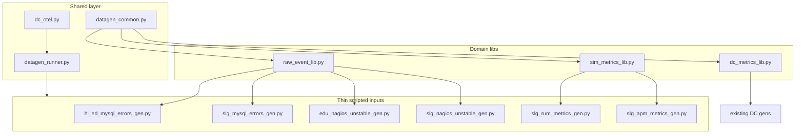
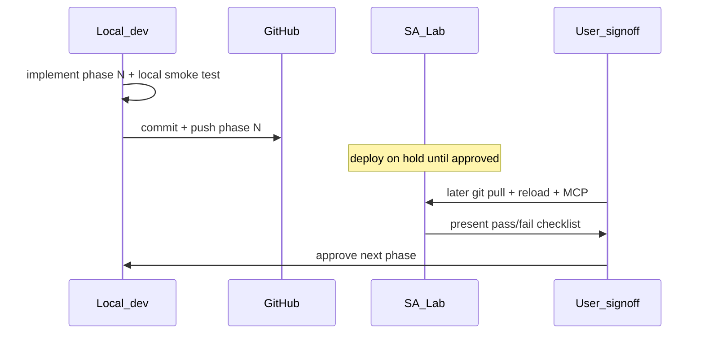

# Incremental makeresults → Python scripted input migration

Saved plan (2026-08-14). Execute one phase at a time with validation and signoff between each. Migration order: **MySQL → Nagios → SLG RUM → SLG APM**.

**Status:** Complete in repo (local smoke tests passed; **SA Lab deploy on hold**)

### Deployment policy (2026-08-14)

**Do not** `git pull`, reload, or restart scripted inputs on SA Lab until explicitly approved.

| Step | Where | When |
| --- | --- | --- |
| Implement + local smoke test | Dev workstation / repo | Done |
| Commit + push | GitHub (`feature/sa-lab-savedsearches-throttle`) | Done |
| Pull + reload + MCP validation | SA Lab | **Hold** — user or ops triggers later |

| Phase | ID | Status |
|-------|-----|--------|
| 0 | Extract `datagen_common.py` + `datagen_runner.py` | complete |
| 1 | `hi_ed_mysql_error_generator` | complete (repo) |
| 2 | `slg_mysql_error_generator` | complete (repo) |
| 3 | `EDU Nagios Unstable Alerts` | complete (repo) |
| 4 | `SLG Nagios Unstable Alerts` | complete (repo) |
| 5 | `SLG RUM Generator` | complete (repo) |
| 6 | `SLG APM Generator` | complete (repo) |

To deploy on SA Lab when approved: pull branch, enable each scripted input in `local/inputs.conf`, run `bin/reload-mr-data-gen-conf.sh`, restart scripts one at a time, then run MCP validation SPL from the phase checklist below.

---

## Scope

**In scope (currently enabled on SA Lab):**

| Saved search | Index | Output type | Heavy pattern |
| --- | --- | --- | --- |
| [hi_ed_mysql_error_generator](../local/savedsearches.conf) | `mysql` | raw `_raw` log lines | `makeresults` + `map` (variable fan-out) |
| [slg_mysql_error_generator](../local/savedsearches.conf) | `mysql` | raw `_raw` log lines | same |
| [EDU Nagios Unstable Alerts](../default/savedsearches.conf) | `nagios` | raw serviceperf lines | `makeresults count=5` + `map maxsearches=500` |
| [SLG Nagios Unstable Alerts](../default/savedsearches.conf) | `nagios` | raw serviceperf lines | same |
| [SLG RUM Generator](../local/savedsearches.conf) | `sim_metrics` | JSON metrics (`mcollect`) | single `makeresults` |
| [SLG APM Generator](../local/savedsearches.conf) | `sim_metrics` | JSON metrics (7 streams) | nested `makeresults` subsearches |

**Out of scope for now:** disabled searches (Hi ED RUM, HiEd APM, Synthetics, DC SPL fallbacks). Design shared libraries so those can be added later with config only.

---

## Target architecture

Reuse the proven DC pattern ([`bin/dc_metrics_gen.py`](../bin/dc_metrics_gen.py), [`bin/dc_metrics_lib.py`](../bin/dc_metrics_lib.py), [`bin/dc_otel.py`](../bin/dc_otel.py), per-generator `*_datagen.conf`, [`default/inputs.conf`](../default/inputs.conf) stanzas, disable SPL in [`local/savedsearches.conf`](../local/savedsearches.conf)).



### Shared code to extract (Phase 0 — refactor only)

Pull common helpers out of [`bin/dc_metrics_lib.py`](../bin/dc_metrics_lib.py) into **`bin/datagen_common.py`**:

- `get_app_dir()`, `load_settings(config_name)`, `spl_random()`
- `in_demo_window()` (Mon–Fri 08:00–18:00 ET — already used by DC gens)
- **New:** `in_minute_window(settings, now)` for cron-style minute gates (`demo_minute_start` / `demo_minute_end` in conf)
- `load_csv_lookup()` (generalize `load_hosts()`)

Generalize [`bin/dc_metrics_gen.py`](../bin/dc_metrics_gen.py) → **`bin/datagen_runner.py`**:

- Accept `(config_name, iter_fn)` so DC and new gens share one runner + [`bin/dc_otel.py`](../bin/dc_otel.py) telemetry wrapper
- Keep existing DC thin scripts working unchanged

**Phase 0 exit criteria:** all four DC scripted inputs still emit 16/16/18/18 hosts locally; no SA Lab deploy required unless you want a sanity check.

---

## Two output modes

| Mode | Generators | stdout format | Index-time config |
| --- | --- | --- | --- |
| **Metric JSON** | DC (done), RUM, APM | pure JSON + `index_host` field | [`default/props.conf`](../default/props.conf) + reuse [`edu_dc1_log_to_metrics`](../default/transforms.conf) pattern |
| **Raw events** | MySQL, Nagios | `_MetaData:Host::host\n` + raw line (safe for non-JSON) | existing [`nagios:core:serviceperf`](../default/props.conf) props; `mysqld` sourcetype unchanged |

Raw generators do **not** need log-to-metrics transforms. Metric generators need new sourcetypes, e.g. `mr_datagen:rum_metrics`, `mr_datagen:apm_metrics`, with METRIC-SCHEMA-TRANSFORMS listing RUM/APM field names from [`rum_metrics`](../default/macros.conf) and SLG APM search in [`local/savedsearches.conf`](../local/savedsearches.conf).

---

## Domain libraries

### `bin/raw_event_lib.py` (MySQL + Nagios)

Port SPL logic from [`default/savedsearches.conf`](../default/savedsearches.conf):

**MySQL** (`hi_ed_mysql_error_generator` / `slg_mysql_error_generator`):

- Host prefix from config: `EDU_DC_1_MySQL_` vs `SLG_DC_1_MySQL_`
- 4 hosts (`_01`–`_04`), minute gate **41–59**
- `logcount = round(minute * 2 / 10)` duplicate lines per host per run (replaces `map`)
- Fixed logline template (disk full CRITICAL message)

**Nagios unstable** (`EDU Nagios Unstable Alerts` / `SLG Nagios Unstable Alerts`):

- Host prefix: `EDU_DC_MySQL_0` + count vs `SLG_DC_1_MySQL_0` + count (match existing host names exactly)
- 5 events per run (`makeresults count=5`), minute gate **39–59**
- Build `[SERVICEPERFDATA]\t… PING CRITICAL …` line from SPL template

Config files: `default/hi_ed_mysql_datagen.conf`, `default/slg_mysql_datagen.conf`, `default/edu_nagios_unstable_datagen.conf`, `default/slg_nagios_unstable_datagen.conf`.

### `bin/sim_metrics_lib.py` (RUM + APM)

Port macros/search logic:

**RUM** — port [`rum_metrics(1)`](../default/macros.conf) into `apply_rum_metrics(env, minute)`; config `sf_environment=license_renewal_rum` for SLG RUM.

**APM** — port [`apm_base(1)`](../local/macros.conf) + SLG APM stream table (7 JSON payloads per run) into `iter_apm_streams(service_name)`; values from [`local/savedsearches.conf`](../local/savedsearches.conf) lines 89–97.

Config files: `default/slg_rum_datagen.conf`, `default/slg_apm_datagen.conf`.

---

## Per-phase workflow (repeat for each generator)

Each phase is a **separate commit + local validation gate**. SA Lab deploy is deferred (see deployment policy above).



### Local build steps (each phase — now)

1. Add scripted input, conf, props/transforms, and `[Saved Search] disabled = 1` in repo
2. Smoke test: `python3 bin/<script>_gen.py | head` (expect `_MetaData:Host::` or JSON lines)
3. `git commit` + `git push` to GitHub

### SA Lab deploy steps (hold until approved)

1. `git pull` on SA Lab (stash/restore [`local/inputs.conf`](../local/inputs.conf) HEC tokens if needed)
2. Enable new scripted input in `local/inputs.conf` (`disabled = 0`, set interval)
3. `bin/reload-mr-data-gen-conf.sh` (HTTP 200 on inputs/props/transforms/savedsearches)
4. `splunk _internal call /services/data/inputs/script/restart` for the **one** new script
5. Confirm SPL search remains `disabled = 1` for that generator

**Never** run SPL and scripted input for the same generator simultaneously on SA Lab.

### Validation checklist (each phase)

| Check | How |
| --- | --- |
| Scripted input active | `btool inputs list` → `disabled=0` for new script |
| SPL disabled | `btool savedsearches list` → matching search `disabled=1` |
| Script ran | `index=_internal source=*splunkd.log* "<script>_gen: hosts=" earliest=-15m` |
| SPL stopped | `index=_audit savedsearch_name="<name>" earliest=-15m` → 0 new runs after cutover |
| Data present | index-specific SPL below |
| Scheduler relief | optional `_audit` inline run count drop for that search name |

Update [`.cursor/rules/datagen-mcp-validation.mdc`](../.cursor/rules/datagen-mcp-validation.mdc) with per-generator MCP queries as each phase lands.

---

## Phase-by-phase plan

### Phase 1 — `hi_ed_mysql_error_generator`

- Add `bin/hi_ed_mysql_errors_gen.py`, `raw_event_lib.py`, `hi_ed_mysql_datagen.conf`, inputs stanza → `index=mysql`, `sourcetype=mysqld`, `source=/usr/local/mysql/logs/mysqld.log`
- SA Lab interval: **300** (or 60 during testing); minute gate 41–59 handled in Python
- **Validate:** `index=mysql host=EDU_DC_1_MySQL_* sourcetype=mysqld earliest=-15m | stats count by host` → 4 hosts; log line contains `Disk is full`; duplicate volume matches `logcount` formula at minute 45
- **Disable SPL:** `[hi_ed_mysql_error_generator] disabled = 1`

### Phase 2 — `slg_mysql_error_generator`

- Add `bin/slg_mysql_errors_gen.py` + config (host prefix `SLG_DC_1_MySQL_` only delta)
- Reuse `raw_event_lib.py` entirely
- **Validate:** same as Phase 1 for `SLG_DC_1_MySQL_*`
- **User signoff** before Phase 3

### Phase 3 — `EDU Nagios Unstable Alerts`

- Add `bin/edu_nagios_unstable_gen.py` + config
- **Validate:** `index=nagios host=EDU_DC_MySQL_* sourcetype=nagios:core:serviceperf earliest=-15m | stats count by host` → up to 4–5 hosts; `_raw` contains `PING CRITICAL` and `Host Unavailable`
- Confirm existing [`nagios:core:serviceperf`](../default/props.conf) EVAL/fieldalias still enrich events

### Phase 4 — `SLG Nagios Unstable Alerts`

- Add `bin/slg_nagios_unstable_gen.py` (host prefix `SLG_DC_1_MySQL_0`)
- **Validate:** `index=nagios host=SLG_DC_1_MySQL_* …`
- **User signoff** before Phase 5

### Phase 5 — `SLG RUM Generator`

- Add `bin/sim_metrics_lib.py`, `bin/slg_rum_metrics_gen.py`, props/transforms for `mr_datagen:rum_metrics`
- Port [`rum_metrics`](../default/macros.conf) including minute>39 spike behavior
- **Validate:** `| mstats sum(rum.page_view.count) WHERE index=sim_metrics sf_environment=license_renewal_rum earliest=-15m` → non-null; compare field set to pre-cutover baseline
- Hi ED RUM remains disabled; library ready for future `course_registration_rum` config

### Phase 6 — `SLG APM Generator`

- Add `bin/slg_apm_metrics_gen.py`, props for `mr_datagen:apm_metrics`
- Emit 7 JSON metric documents per run (replaces nested subsearches)
- **Validate:** `| mstats sum(service.request.count) WHERE index=sim_metrics sf_service=license_renewal earliest=-15m BY sf_streamLabel,sf_error` → 7 stream combinations with expected static values (50, 1, 0.12, etc.)
- HiEd APM remains disabled; same library supports `course_registration` later

---

## Config conventions (all new gens)

Mirror existing DC datagen conf pattern ([`default/edu_dc2_datagen.conf`](../default/edu_dc2_datagen.conf)):

```ini
[settings]
demo_hours_only = true
demo_start_hour = 8
demo_end_hour = 18
demo_days = mon,tue,wed,thu,fri
demo_timezone = America/New_York
demo_minute_start = 41   # per generator
demo_minute_end = 59
index = mysql
sourcetype = mysqld
source = /usr/local/mysql/logs/mysqld.log

[observability]
enabled = false
service_name = mr_data_gen_hi_ed_mysql
metric_prefix = hi_ed_mysql
```

SA Lab overrides in `local/<name>_datagen.conf` (observability, interval) without touching tokens in git.

---

## Documentation updates (incremental)

After each phase, append to [`README.md`](../README.md) and [`docs/sa-lab-reliability-validation-baseline.md`](sa-lab-reliability-validation-baseline.md):

- scripted input stanza name
- SPL search to disable
- validation SPL
- expected `_audit` run reduction

---

## Risk notes

- **Host naming:** Nagios uses `EDU_DC_MySQL_01` (no `_1_`); MySQL uses `EDU_DC_1_MySQL_01`. Python must match exactly or ITSI/Nagios dashboards break.
- **Minute windows:** Scripted inputs run on interval but emit nothing outside 39–59 / 41–59; validate during demo hours **after minute 41**, not at top of hour.
- **Duplicate volume:** MySQL `logcount` can emit 0 lines at minute 41; confirm that matches legacy SPL behavior.
- **No Splunk restart:** use inputs reload + per-script REST restart only (same as DC migration).
- **Rollback:** re-enable SPL search (`disabled=0`), disable scripted input, reload — keep SPL search definitions in `default/savedsearches.conf` as fallback.
